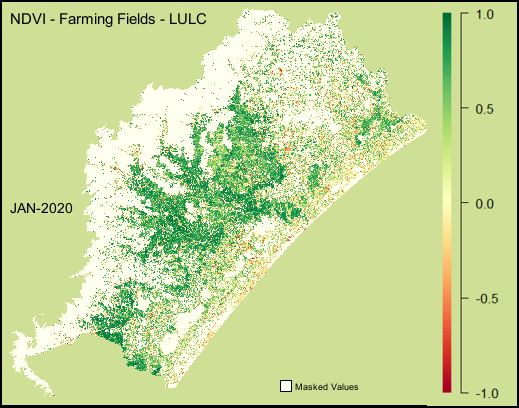
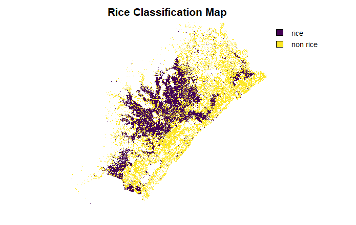
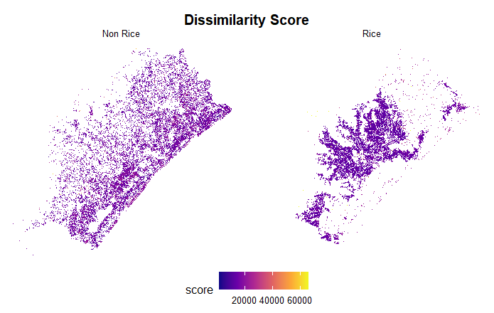
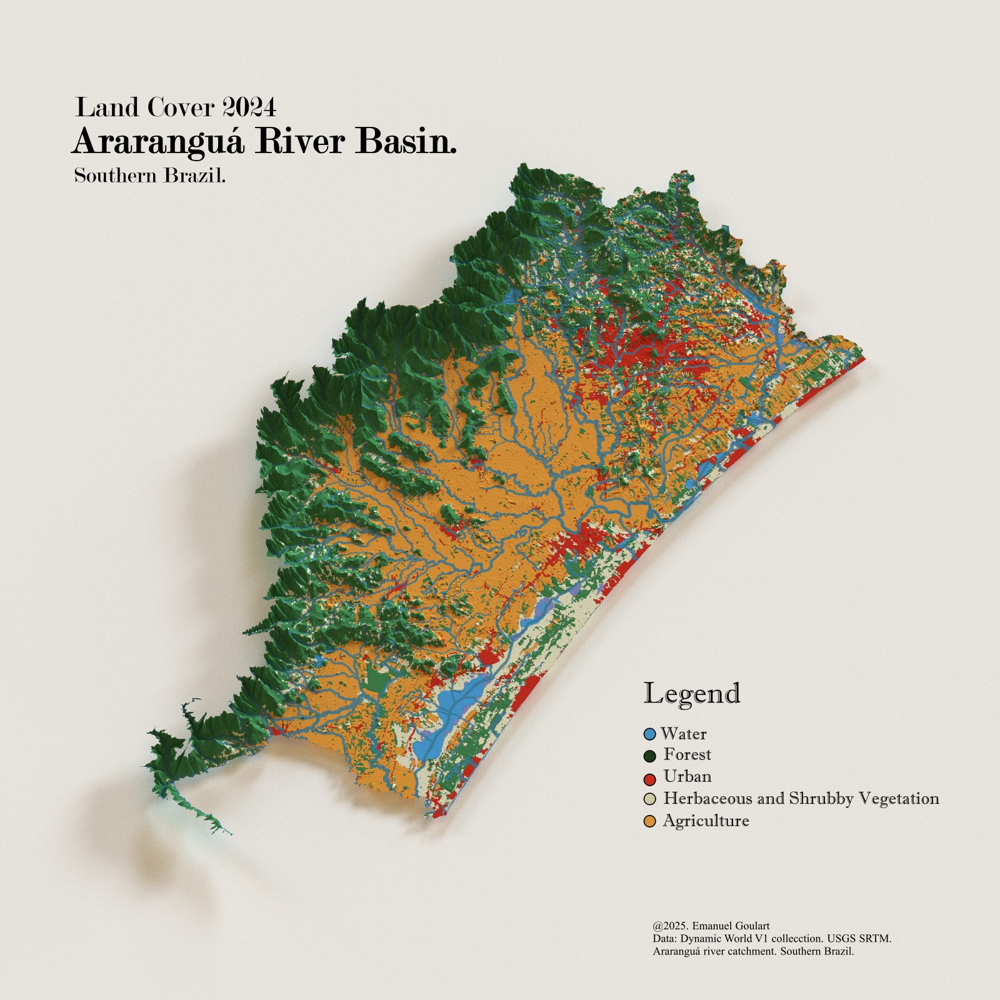
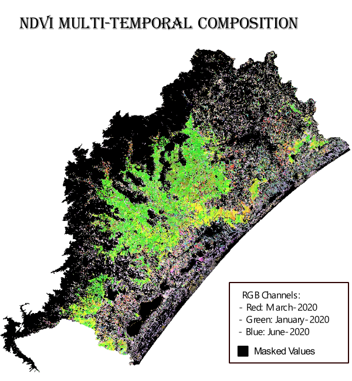

Time-Weighted Dynamic Time Warping (TW-DTW)

This is a implementation of the TW-DTW to classify paddy rice crops in southern Brazil.

The current repository is a show-case of how TW-DTW has robustness on classifing time crops, taking its seasonality by looking at the similarity of time series. 

The study is based on a multi-sensor approach, using Sentinel-1 and Sentinel-2.

## QuickStart

- For a better context and understading, please have a look at the study.[]()

- The whole study version is publish here: []()

## Repository Structure

```bash 
scripts_R
 ┣ Colab
 ┃ ┗ DTW_GEE_python.ipynb ## Retrieves the time series spectral
 ┣ GEE
 ┃ ┣ tw-dtw-downloader.js # Prepare files to be download
 ┃ ┣ twdtw-binary-classification ## Implement the TWDTW from the scratch
 ┃ ┣ twdtw-result-analysis2 # PostProcessing1
 ┃ ┗ twdtw_result_analysis_assessment.js #PostProcessing2 - Implement connectivy and focal mean
 ┣ pdf
 ┃ ┗ Emanuel-TWDTW.pdf ## Complete study
 ┣ Plots ## Plots and figs
 ┣ R
 ┃ ┣ barplot.R
 ┃ ┣ barplot2.R
 ┃ ┣ colorbar.R
 ┃ ┣ dtw_score.R ##Plot dissimilarity scores
 ┃ ┣ multi_temporal.kra
 ┃ ┗ vis-sits.R ## Plot multi-temporal 
 ┣ skeleton_cache ## cache of Rmarkdown
 ┣ .gitignore
 ┣ .Rhistory
 ┣ presentation.md
 ┣ README.md
 ┣ skeleton.bib
 ┣ skeleton.html
 ┣ skeleton.Rmd
 ┗ skeletones.bib
 ```

## Utils

- Check this GEE panel with the all results: [Results]("https://ee-emanuelgoulartf.projects.earthengine.app/view/twdtw-resultspanel")

## GIF




## Classification Results



## Dissimilarity Score



## LULC of Araranguá Region:



## Multi-Temporal Time Series of NDVI 



# Acknowledgements 

- [SoilWatch]("https://github.com/SoilWatch")
- [Willian Oulette]("https://github.com/wouellette/ee-dynamic-time-warping")
- [MapBiomas]("https://brasil.mapbiomas.org/en/")
