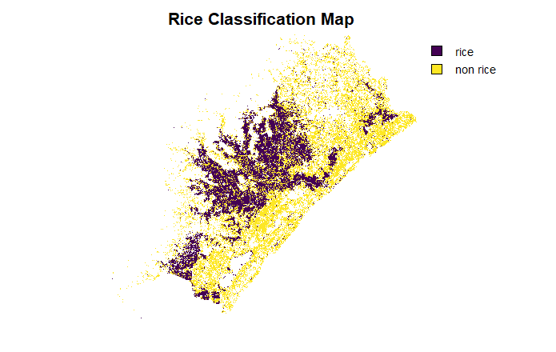
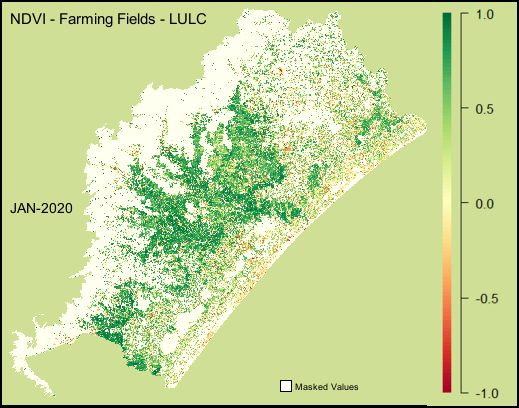
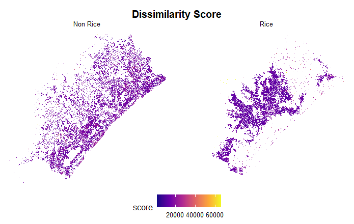
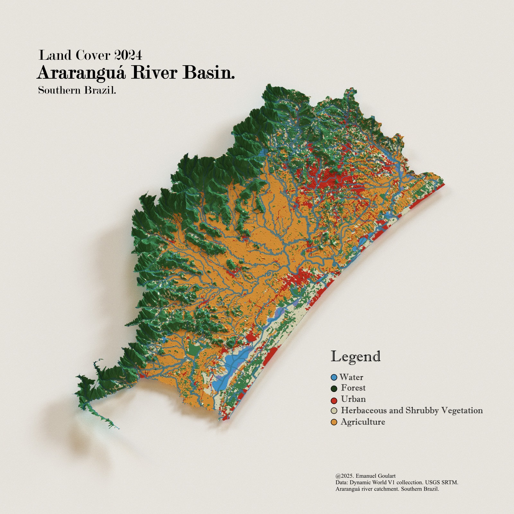
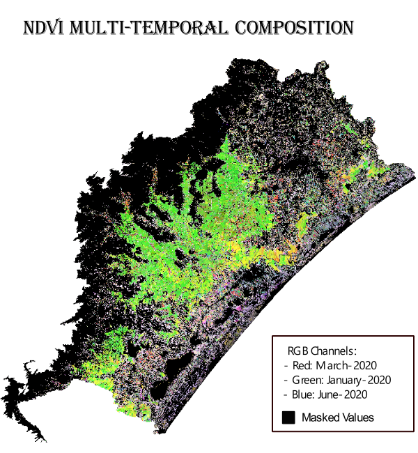

Time-Weighted Dynamic Time Warping (TW-DTW)

This is a implementation of TW-DTW to classify paddy rice crops in southern Brazil on google earth engine.

## Classification Results




The repo is a show-case of how TW-DTW has robustness on classifing crops, in special, paddy rice, on the context of land use agriculture classes. The algorithm fits a given seasonality when comparing similiarity of time series, having its strength  by capturing periodicity as a feature over the time dimension. 

Perhaps an interesing feature for deep learning models

The study is based on a multi-sensor approach, using Sentinel-1 and Sentinel-2.

## QuickStart

1. Here there're some content about it and brief introduction. 
[Study Case](https://emanuel-gf.github.io/tw-dtw-rice-classification/)

2. Panel with the assets outputs from twdtw: [PANEL-GEE-OUTCOME](https://ee-emanuelgoulartf.projects.earthengine.app/view/twdtw-resultspanel)


3 - Here the .pdf of study case which originates this repo. Developed for Analysis and Modelling subject at [Copernicus Master](https://master-cde.eu/) - [PDF](https://github.com/emanuel-gf/tw-dtw-rice-classification/blob/main/pdf/Emanuel-TWDTW.pdf)

The scripts are within this repo

## Repository Structure

```bash 
scripts_R
 ┣ Colab
 ┃ ┗ DTW_GEE_python.ipynb ## Retrieves the time series spectral
 ┣ GEE
 ┃ ┣ tw-dtw-downloader.js # Prepare files to be download
 ┃ ┣ twdtw-binary-classification ## Implement the TWDTW from the scratch
 ┃ ┣ twdtw-result-analysis2 # PostProcessing1
 ┃ ┗ twdtw_result_analysis_assessment.js #PostProcessing2 - Implement connectivy and focal mean
 ┣ pdf
 ┃ ┗ Emanuel-TWDTW.pdf ## Complete study
 ┣ Plots ## Plots and figs
 ┣ R
 ┃ ┣ barplot.R
 ┃ ┣ barplot2.R
 ┃ ┣ colorbar.R
 ┃ ┣ dtw_score.R ##Plot dissimilarity scores
 ┃ ┣ multi_temporal.kra
 ┃ ┗ vis-sits.R ## Plot multi-temporal 
 ┣ skeleton_cache ## cache of Rmarkdown
 ┣ .gitignore
 ┣ .Rhistory
 ┣ presentation.md
 ┣ README.md
 ┣ skeleton.bib
 ┣ skeleton.html
 ┣ skeleton.Rmd ## Create the study case file
 ┗ skeletones.bib ## add bib for the .Rmd
 ```

## Utils

- Check this GEE panel with the all results: [Results](https://ee-emanuelgoulartf.projects.earthengine.app/view/twdtw-resultspanel)

## GIF




## Dissimilarity Score



## LULC of Araranguá Region:



## Multi-Temporal Time Series of NDVI 



# Acknowledgements 

- [SoilWatch](https://github.com/SoilWatch)
- [Willian Oulette](https://github.com/wouellette/ee-dynamic-time-warping)
- [MapBiomas](https://brasil.mapbiomas.org/en/)
- [Hannah Augustin](https://github.com/augustinh22)


