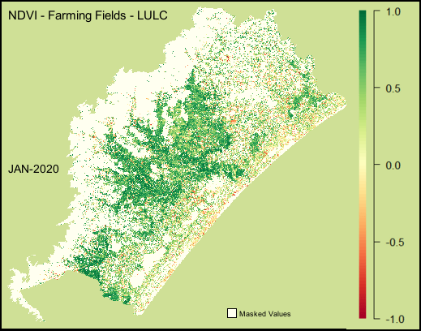
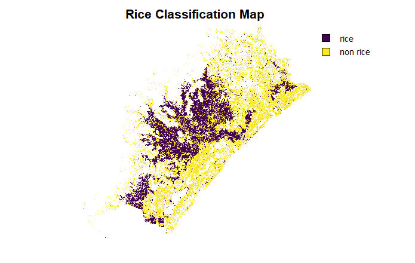

```{r setup, include=FALSE}
library(tufte)
# invalidate cache when the tufte version changes
knitr::opts_chunk$set(cache.extra = packageVersion('tufte'))
options(htmltools.dir.version = FALSE)
```

# Introduction


```{r marginfigure, fig.margin = TRUE, fig.cap = "DTW for speech recognition and shape matching of words.", fig.width=2.5, fig.height=2.0, echo=FALSE}

```
I stumbled upon Dynamic Time Warping (DTW) during a lecture in Earth Observation. Apparently, in the 80's, researchers studying speech patterns developed a measure for describing the similarity between two temporal sequences. Although the DTW technique is robust for shape matching, some authors argue that it is not well suited for remote sensing (RS) because it disregards the temporal range when finding the best alignment.

`r newthought('Think of')` it as each land-cover class having a distinct phenological cycle that is relevant for space–time classification and should be considered for crop monitoring. Therefore, a good time-series land-cover classifier needs to balance shape matching with temporal alignment. 

[image with crops classification]


@Maulsetal  introduced an improvement by adding a time-weight constraint to DTW. Other developments include treating classification as an object-based rather than pixel-based task, which helps avoid the salt-and-pepper effect. In the RS field, Earth monitoring has been ongoing for many years, and DTW has emerged as a potential tool.


## Context 

There is no much things on TW-DTW for RS around. The tw-dtw implementation is in @R-base, which I love, but my laptop seems to struggle on bigger tasks. Necessity pushes us to explore some alternatives and thanks to RS community, there is an implementation of the TW-DTW algorithm in GEE. ^[See Github repository: [Willian Oullette]("https://github.com/wouellette/ee-dynamic-time-warping")]

`r tufte::newthought("This is ")`  a case study of DTW applied for classifying paddy rice crops.

The prime is that tw-dtw performs well without limited training data, making it particularly valuable in data-scarce scenarios. Contrasting with deep-learning (DL) methods which usually requires a higher data training to not under-perform. 


## MAPBIOMAS


```{r iconmapbiomas, fig.margin = TRUE, fig.width=1.0, fig.height=1.0, echo=FALSE}

```


MapBiomas^[See at :[MapBiomas]("https://brasil.mapbiomas.org/en/")] is a multi-institutional network providing annual land use land cover (LULC) datasets and monitoring territorial changes, mainly for Brazil. Collection 8, released in 2022, made available a land use mapping of Irrigated Agriculture, classifying irrigation rice crops (paddy rice) in partnership with Brazil's Water Agency and Embrapa. This collection produces a classification layer and generates annual rice area estimates.

```{r mapbiomasmapintroduc, fig.margin = TRUE, fig.cap = "Snippet of MapBiomas panel.", fig.width=2.5, fig.height=2.0, echo=FALSE}

```


The Irrigated Collection, the approach was based on Deep Learning methods using UNet architecture, which has been among the state-of-the-art models for image classification, segmentation, and other tasks. However, DL models, especially for Earth Observation applications, typically demand many training samples.

## Brazil's Rice Heartleand

```{r brazil, fig.margin = TRUE, fig.cap = "Location of Santa Catarina within Brazil.", fig.width=3.5, fig.height=2.5, echo=FALSE}

```

I was born and raised in this small city where everyone knows each other, surrounded by the sea and facing a river, an outlet of a large basin. Most of my river's swimming was often alongside vast paddy rice fields that stretched across the entire area. It's common for paddy rice fields to follow the river channel distribution. Perhaps their full extent can be difficult to gauge from ground level, from ground level, looking from above makes it possible to estimate.

```{r santacatarina, fig.margin = TRUE, fig.cap = "Ararangua hydrographical region.", fig.width=2.0, fig.height=1.5, echo=FALSE}
knitr::include_graphics("Plots/qualitymap/REGIAO10.JPG")
```


Through my mostly weekly swimming sessions^[.],the seasons gradually began revealing their patterns, a display of seasonality observed firsthand. At times, the rice fields were a uniform green, covering the parcels like a grassy carpet; other times, they were flooded, attracting birds to the temporary wetlands; and at inter-crop periods, the bare soil was visible. The timing of these seasonal changes in the crops creates a temporal pattern and this ideal scenario for DTW analysis.


```{r manhoso, fig.margin = TRUE, fig.width = 0.5, fig.height = 0.5, fig.cap="Spot for swimming surrounded by the paddy rices.", fig.show='hold', cache=TRUE, message=FALSE,echo=FALSE}

```


Where are talking about southern Brazil, in the Santa Catarina state, home to the small yet big-hearted of `r newthought("Araranguá")`.

Perhaps what makes this region particularly interesting is its diversity. The landscape transitions from the rugged mountainous plateau in the west, where banana plantations cascade down the hillsides, to the flat coastal plains where rice paddies dominate the river valleys. Urban centers are relatively small. This is not an industrial hub but rather a region whose economy is fundamentally rooted in agriculture. Land use and land cover (LULC) maps provide a clear overview of how the land is actually utilized in the region.


```{r fig-fullwidth1, fig.width = 6, fig.height = 2, fig.fullwidth = TRUE, fig.cap = "", warning=FALSE, message=FALSE, cache=TRUE, echo=FALSE}
knitr::include_graphics("Plots/lulc_.jpg")
```


```{r barplot, fig.height = 3, fig.margin = TRUE, fig.cap = "Percentage of land use for each class.", warning=FALSE, message=FALSE, cache=FALSE, echo=FALSE}

```

The region has a total area of **48,810 km²**, agriculture represents **54%** of the land use, forest represents **32.8%** f the area and cities accounts only for **5%**.  This region represents more than just farmland; it is an economic lifeline, with rice cultivation accounting for **41%** of all agricultural activity.

# Seasonal patterns

The land seasonality of the region can be well observed when combining different spectral bands from satellite data. The NDVI is a index quantifies the "greenness" of each pixel. ^[[NDVI-GIF]("https://github.com/emanuel-gf/tw-dtw-rice-classification/blob/main/GIF-NDVI.gif")]

```{r figgif, fig.margin = TRUE, fig.cap = "Monthly NDVI", warning=FALSE, message=FALSE, cache=FALSE, echo=FALSE}

```


There is an interesting burst of green during the summer (January), which corresponds to the phenological peak of the rice crops and reflects the full development of the crop canopy. Following flowering, the rice enters the maturation phase, culminating in harvest when the seeds reach their maximum weight—a timing strongly influenced by prevailing weather conditions. After harvest, the NDVI drops, eventually turning completely red, representing the off-season when the land is left as bare soil.

# Paddy Rice Spreading


Note that the GIF above do not classify crops, rather it highlights a spetacular seasonal pattern occurring across many pixels.


A classification of paddy rice crops is given by the Irrigation Collection^[Irrigation Collection was based on Unet Deep-Learning method.], from MapBiomas. The spatial distribution of the classified paddy rice represents the same patterns observed in the GIF above. 

From the observed seasonality, the paddy rice fields exhibit a spatial pattern by spreading extensively across the flat areas of the basin. When it gets towards the west where the mountains are, the land use is identified mostly as forests,

The following map exhibits the paddy rice class extracted from the Irrigation Collection. 


```{r paddyrice-mapbiomas,fig.cap="Author", fig.width = 4, fig.height = 2, fig.fullwidth = TRUE, warning=FALSE, message=FALSE, cache=TRUE, echo=FALSE}

```


## TW-DTW

Coming back to TW-DTW, the main strength of this method lies in its lower demand for large numbers of samples. This advantage becomes particularly relevant in regions with scarce data, where deep learning models would otherwise require extensive labeled samples. Fewer required classes also enhance the model’s generalization capacity in such contexts.

***Feature Space***

```{r table, echo=FALSE}
library(knitr)

# Feature space table
features <- data.frame(
  Feature = c(
    "Sentinel-2 Band 08",
    "Sentinel-2 Band 12",
    "Sentinel-2 Derived Index",
    "Sentinel-1 VH",
    "Sentinel-1 VV"
  ),
  Description = c(
    "NIR (InfraRed)",
    "SWIR1 (Near Infrared)",
    "NDVI (Normalized Difference Vegetation Index)",
    "Horizontal Backscattering",
    "Vertical Backscattering"
  )
)

kable(features, 
      caption = "Feature space",
      align = c("l","l"))
```

**Sampling**
```{r table-sample, echo=FALSE}
library(knitr)

# Feature space table
features <- data.frame(
  Feature = c(
    "Rice",
    "Non Rice"
  ),
  Number = c(
    "13",
    "13")
)

kable(features, 
      caption = "Training Samples",
      align = c("l","l")
)
```

`r margin_note("
See a explanation about the TW-DTW parameters here: https://github.com/wouellette/ee-dynamic-time-warping/blob/master/dtw.js
")`


```{r spectral,fig.margin=TRUE,fig.cap="Sampling Backscatering and Spectral signatures", fig.width = 2, fig.height = 2, fig.fullwidth = TRUE, warning=FALSE, message=FALSE, cache=TRUE, echo=FALSE}

```


**Parameters of TW-DTW **
```{r margin-table, fig.margin=TRUE, echo=FALSE}

library(knitr)

# TW-DTW parameters table
twdtw_params <- data.frame(
  Parameter = c(
    "Constrain Type",
    "Distance Measure",
    "Temporal Range",
    "Number of Bands",
    "Beta - (Time Constraint)",
    "Alpha"
  ),
  Value = c(
    "Time-constrained",
    "Euclidean Distance",
    "12 months",
    "5",
    "45 days",
    "0.1"
  )
)

kable(twdtw_params
)
```


# Results

## Classification 

The TW-DTW output provides a binary classification of rice and non-rice crops.

```{r paddyrice-classific, fig.cap="Contrast of paddy rice among all other crop types. Author", fig.width = 3.5, fig.height = 2, fig.fullwidth = TRUE, warning=FALSE, message=FALSE, cache=TRUE, echo=FALSE}

```


The TW-DTW classification results show that rice crops closely follow the patterns observed in the multi-temporal NDVI composite. However, a noticeable salt-and-pepper effect is present, with many isolated rice pixels scattered across the map. These isolated pixels are likely misclassified, as small-size paddy rice fields are rare due to economic constraints. This highlights the need for post-processing to reduce noise and improve the spatial coherence of the classification.


## Dissimilarity Score 

Another output of the DTW implementation in GEE is the dissimilarity score, which quantifies the distance between each pixel’s time series and the reference rice time series. 


```{r paddyrice-dissim, fig.cap="Author", fig.width = 3, fig.height = 2, fig.fullwidth = TRUE, warning=FALSE, message=FALSE, cache=TRUE, echo=FALSE}
knitr::include_graphics("Plots/qualitymap/diss_score.png")
```


These dissimilarity scores represent the distance between each pixel’s time series and the reference rice time series. Generally, lower scores indicate higher similarity to the target class, whereas higher scores suggest that the pixel is less likely to belong to that class.

```{r hist-rice, fig.height = 5.,fig.width= 5., fig.margin = TRUE,fig.cap="Dissimilarity histogram of Rice",   warning=FALSE, message=FALSE, cache=TRUE, echo=FALSE}
library(magick)
img <- image_read("Plots/qualitymap/hist_rice.png")
image_write(img, "Plots/qualitymap/hist_rice_trim.png")

```

In the dissimilarity map, paddy rice fields typically have scores ranging from 0 to approximately 20,000. Beyond this threshold, the number of pixels with high dissimilarity scores decreases substantially, indicating fewer samples with low similarity. This demonstrates that the TW-DTW algorithm effectively leverages these scores for classification, and thresholding provides a deterministic way to fine-tune the classification by separating likely rice pixels from others.


The dissimilarity scores for rice pixels also exhibit a lower standard deviation compared to non-rice pixels, reflecting less variability within the rice class. The rice histogram shows a pronounced tail and a relatively small secondary peak around a dissimilarity score of 60,000, a feature absent in the non-rice histogram. Although non-rice scores display greater variability, they are confined to a narrower range compared to rice.


## Assessment 

```{r iconjaccard, fig.margin = TRUE,fig.cap = "Jaccard Index", fig.width=0.8, fig.height=1.0, echo=FALSE}

```


```{r icondice, fig.margin = TRUE,fig.cap = "Dice Coefficient", fig.width=0.8, fig.height=1.0, echo=FALSE}
knitr::include_graphics("Plots/icons/dice.png")
```

To assess the results, Jaccard Index, Overlap and Dice coeffient.

```{r table-results, echo=FALSE}
library(knitr)

# Create the data frame
tw_dtw_results <- data.frame(
  Asset = c(
    "Irrigation MapBiomas",
    "TWDTW",
    "OTSU Threshold",
    "Arbitrary Threshold"
  ),
  Area_km2 = c(9029.62, 8583.86, 8306.36, 8521.98),
  Jaccard_Index = c(1, .8199,.8184,.8196),
  Overlap = c(1, 0.8626, 0.8896, 0.8683),
  Dice = c(NA, 0.84,0.85,0.84),
  Absolute_Error_km2 = c(NA,  445.76, 723.26,  507.64),
  stringsAsFactors = FALSE
)

colnames(tw_dtw_results) <- c(
  "Asset",
  "Area (km2)",
  "Jaccard",
  "Overlap",
  "Dice",
  "Absolute Error (km2)"
)

# Display the table with kable
kable(
  tw_dtw_results, 
  caption = "Similarity of TW-DTW predictions with MapBiomas Irrigation"
)


```

# GEE Panel

`r margin_note("Access the panel at [GEE Panel](https://ee-emanuelgoulartf.projects.earthengine.app/view/twdtw-resultspanel)")`
The results are fully accessible on the [GEE panel](https://ee-emanuelgoulartf.projects.earthengine.app/view/twdtw-resultspanel), where you can compare the TW-DTW predictions with the MapBiomas irrigation collection and other land cover classes.


# **__[ACCESS THE PANEL](https://ee-emanuelgoulartf.projects.earthengine.app/view/twdtw-resultspanel)__**

It is also possible to explore a multi-temporal composition for visualizing some of some band values (e.g: NDVI, VV, NIR). 

```{r paddyrice-ndvi, fig.cap="Multi temporal composition. Red pixels are June, Green pixels are January and the Blue band represents March.", fig.width = 3, fig.height = 2, fig.fullwidth = TRUE, warning=FALSE, message=FALSE, cache=TRUE, echo=FALSE}
knitr::include_graphics("Plots/qualitymap/sits-rs.png")
```

This following image shows a as a red green band the month of January (coidning with the peak of rice crop), red band the month of June (coinciding with the barren soil) and blue in March. 


```{r iconpanelgee, fig.margin = TRUE, fig.width=2.0, fig.height=2.0, fig.cap="Panel exhibiting the results of the current study.",echo=FALSE}

```

If you not well in the gif, you will able to see that a very distinctive peak of green in March also happens, which denote crops types that are yielded before the winter. Which shows up this bluetish pattern on certain areas of the multi-composition

```{r paddyrice-mulitempo, fig.cap="Panel in GEE with the multi-temporal asset available..",fig.margin=TRUE, fig.width = 3, fig.height = 2, fig.fullwidth = TRUE, warning=FALSE, message=FALSE, cache=TRUE, echo=FALSE}
knitr::include_graphics("Plots/icons/sits-gee.png")
```


# Considerations

TWDTW shows a potential for operational crop monitoring, particularly in regions with limited availability of training data. Its ability to achieve competitive accuracy with substantially fewer samples makes it a valuable tool for agricultural monitoring in data-constrained environments.

However, several limitations must be acknowledged. TWDTW is computational expensive, which restricted the analysis to a single year, limiting the evaluation of interannual variability. 

There is also a potential bias from wetland areas. It seems that the signal on wetlands has some degree of proximity with rice fields. It may come from the surface water being higher during flooding periods.

# Further Development

While TW-DTW presents promising capabilities, it also exhibits vulnerabilities that leave considerable room for improvement. In this study, only polarimetric bands VV and VH, along with optical bands SWIR1 and NIR and the NDVI index, were used for inference. Alternative band fusion approaches could be explored, including indices designed to better preserve temporal feature characteristics. It remains unclear whether adding other bands or indices would enhance temporal similarity scores and improve classification performance.

Future developments should integrate radar-based scattering mechanisms related to crop development—such as polarimetric decomposition features, entropy, anisotropy, embedding, and angle measurements—to enrich the temporal information. The dissimilarity score could also be exploited as a temporal tensor or incorporated into hybrid architectures, where TW-DTW serves as a feature within deep learning models.


# Acknowledgements 

The Remote Sensing community is very alive, pushing for more open source frameworks and tools.
Thanks to:

1 - [MapBiomas]("https://brasil.mapbiomas.org/en/") - For the incredible work developed in Brazil.

2 - [Soil Watch]("https://github.com/SoilWatch") - For their work and amazing GEE repositories.

3 - [Willian Oulette]("https://github.com/wouellette/ee-dynamic-time-warping") For implementing twdtw on GEE

4 - All my teachers and colleagues for their inspiring work. [Prof. Dr. Dirk Tiede](https://github.com/dtiede); 

## Thank you 

```{r iconcde, fig.margin = TRUE, fig.width=0.8, fig.height=0.8, echo=FALSE}
knitr::include_graphics("Plots/icons/cde.png")
knitr::include_graphics("Plots/icons/PLUS-logo.jpg")
knitr::include_graphics("Plots/icons/ubs_logo.png")
```

------------------------------------------------------------------------------------
__Emanuel Goulart Farias.__

Master's student at Copernicus Master in Digital Earth and Geodata Science.
This study was conduct as part of a discipline - Analysis and Modelling - within Paris-Lodron University of Salzburg.


- Linkedin : [Linkedin](https://github.com/emanuel-gf)

- Github : [Github]("https://www.linkedin.com/in/emanuel-goulart/")


